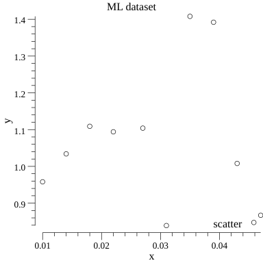

[](https://cloud.drone.io/elahe-dastan/newborn)
# Introduction
This repository is really simple and small I tried to put only basic and most frequently ML algorithms in it, I'm going
to explain all the algorithms implemented in this repository, how you can use them and even the math calculation behind
them for those who are interesting.

# Reading Data And Picturing It
One of the most basic capabilities you'll need for sure is to read data from a dataset and plot it if possible, most of 
the times the dataset is a CSVDataset here is a sample of how to use this library
```go
package main

import (
	"fmt"
	"strconv"

	"github.com/elahe-dastan/newborn/data"
)

func main() {
	headers, content := data.ReadCSVData("./data/dataset_test.csv")
	fmt.Println(headers)

	x := make([]float64, len(content[headers[0]]))
	y := make([]float64, len(content[headers[1]]))

	for i := 0; i < len(content[headers[0]]); i++ {
		x[i], _ = strconv.ParseFloat(content[headers[0]][i], 64)
		y[i], _ = strconv.ParseFloat(content[headers[1]][i], 64)
	}

	data.ScatterPlot(x, y, headers[0], headers[1], "example")
}
```
```
[x y]
```


# Regression
One of the basic things everybody has to learn to study ML is linear regression, logistic regression and
nonlinear regression, regression is used in both predicting a value and classification.<br/>
Let's talk a little deeper about regression, we want to fit a line or curve to a set of data.I'm going to show the math
calculations of what is happening.

[https://elahe-dastan.github.io/newborn/](index.html)